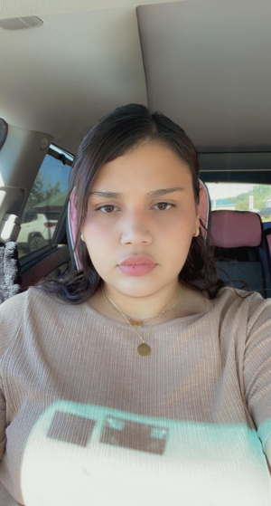

## Summer Dupree

#### About Me

Hello, all! I’m Summer Dupree. I’m Mnicoujou Lakota, from the Cheyenne River Reservation. It’s nice to meet you all! I’m a second-year conservation biology major at OLC. I’m currently working as a second grade paraprofessional aide in my hometown of Dupree, SD. I have two young sons, who are 3 and 4 years old. I like hiking, travelling, learning new things, and I’m passionate about personal growth and living in reciprocity with Uŋčí Makhá (Grandmother Earth) and Wamákȟaškaŋ Oyáte (all that moves upon the Earth.) As everything gets more digital, I’m grateful for this opportunity to learn how to code and process data. I’m new to a lot of this but excited to learn!

[My GitHub profile](https://github.com/sdupree27886)
